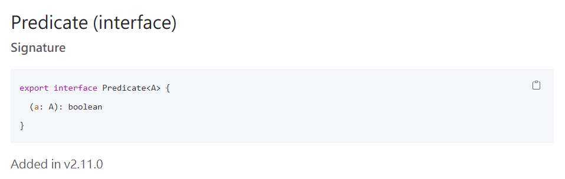
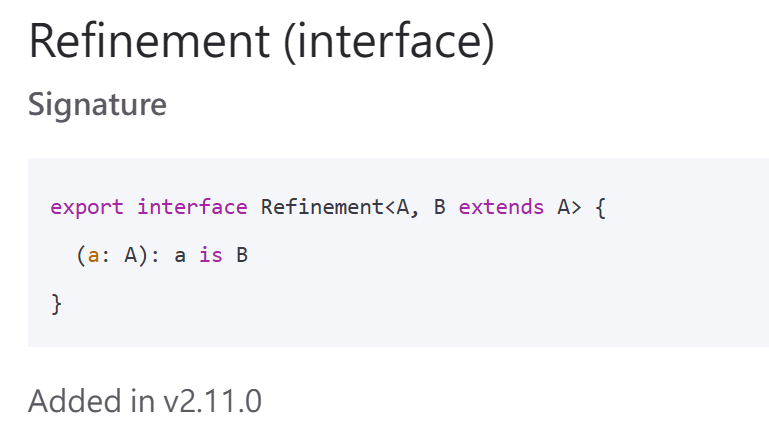
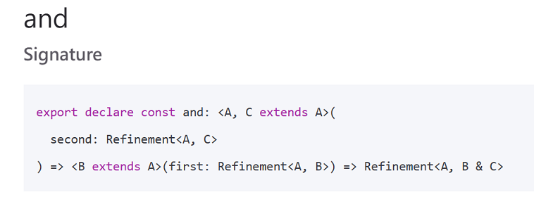
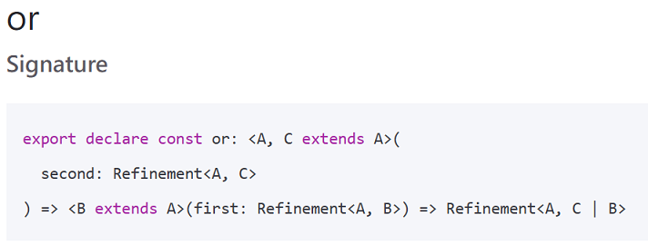
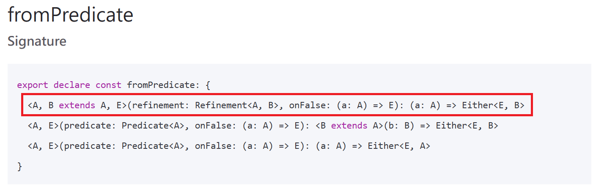

<br/><br/>

### How to parse unreliable data?

- config
- axios response
- user input
- query db result
- request body

[↩️](/index.md#/0/1)

---

<!-- .code font-size="12px" -->

```ts [8-14|16-20|22-34|36-46|48-58]
import dotenv from 'dotenv'
import * as t from 'io-ts'
import assert from 'node:assert/strict'
import { PathReporter } from 'io-ts/PathReporter'

dotenv.config()

// 📝 Let's task config as an example
// Suppose our app requires the following config
type Config = {
  port: string
  mongoDbConnectString: string
  environment: 'test' | 'dev' | 'prod'
}

// 📝 How to parse rawConfig to Config ?
type RawConfig = Record<string, string | undefined>
type ParseConfig = (
  rawConfig: RawConfig
) => t.Validation<Config>

// 📝 With the io-ts magic ...
const ConfigCodec = t.strict(
  {
    port: t.string,
    mongoDbConnectString: t.string,
    environment: t.union([
      t.literal('test'),
      t.literal('dev'),
      t.literal('prod'),
    ]),
  },
  'Config'
)
const rawConfig: RawConfig = process.env
const parseConfig: ParseConfig = ConfigCodec.decode

// 📝 We can get config on parse success
assert.deepStrictEqual(parseConfig(rawConfig), {
  _tag: 'Right',
  right: {
    environment: 'dev',
    mongoDbConnectString: 'mongoTest',
    port: '3000',
  },
})

// 📝 Or get error messages on failed
const badRawConfig = {
  ...rawConfig,
  mongoDbConnectString: undefined,
}
assert.deepStrictEqual(
  PathReporter.report(parseConfig(badRawConfig)),
  [
    'Invalid value undefined supplied to : Config/mongoDbConnectString: string',
  ]
)
```

how-to-parse-unreliable-data/example-1

---


===

# How it works ?

---

### Predicate



---

```ts [18-32|34-44|46-56|58,59,61]
import dotenv from 'dotenv'
import * as P from 'fp-ts/Predicate'
import { pipe } from 'fp-ts/lib/function'
import assert from 'node:assert/strict'

dotenv.config()

type RawConfig = Record<string, string | undefined>

const rawConfig: RawConfig = process.env

type Config = {
  port: string
  mongoDbConnectString: string
  environment: 'test' | 'dev' | 'prod'
}

// 📝 Create predicate function for every config component
const predicatePort: P.Predicate<RawConfig> = (raw) =>
  typeof raw.port === 'string'

const predicateDbString: P.Predicate<RawConfig> = (raw) =>
  typeof raw.mongoDbConnectString === 'string'

const predicateDev: P.Predicate<RawConfig> = (raw) =>
  raw.environment === 'dev'

const predicateTest: P.Predicate<RawConfig> = (raw) =>
  raw.environment === 'test'

const predicateProd: P.Predicate<RawConfig> = (raw) =>
  raw.environment === 'prod'

// 📝 Compose dev, test and prod predicate to env predicate
const predicateEnvironment = pipe(
  predicateDev,
  P.or(predicateTest),
  P.or(predicateProd)
)
assert.equal(predicateEnvironment(rawConfig), true)
assert.equal(
  predicateEnvironment({ ...rawConfig, environment: 'xxx' }),
  false
)

// 📝 Compose port, db and env predicate to config predicate
const predicateConfig = pipe(
  predicatePort,
  P.and(predicateDbString),
  P.and(predicateEnvironment)
)
assert.equal(predicateConfig(rawConfig), true)
assert.equal(
  predicateConfig({ ...rawConfig, port: undefined }),
  false
)

// 😢 the 'config' inside if scope is RawConfig
// not Config
if (predicateConfig(rawConfig)) {
  const config = rawConfig
}
```

how-to-parse-unreliable-data/example-2

===

### Refinement



---




---

```ts [18-47|49-59|60-71|73,75]
import dotenv from 'dotenv'
import * as RF from 'fp-ts/Refinement'
import { pipe } from 'fp-ts/lib/function'
import assert from 'node:assert/strict'

dotenv.config()

type RawConfig = Record<string, string | undefined>

const rawConfig: RawConfig = process.env

type Config = {
  port: string
  mongoDbConnectString: string
  environment: 'test' | 'dev' | 'prod'
}

// 📝 Create refinement function for every config component
type PortConfig = { port: string }
const refinementPort: RF.Refinement<RawConfig, PortConfig> = (
  raw: RawConfig
): raw is PortConfig => typeof raw.port === 'string'

type DbConfig = { mongoDbConnectString: string }
const refinementDbString: RF.Refinement<RawConfig, DbConfig> = (
  raw: RawConfig
): raw is DbConfig =>
  typeof raw.mongoDbConnectString === 'string'

type EnvDevConfig = { environment: 'dev' }
const refinementDev: RF.Refinement<RawConfig, EnvDevConfig> = (
  raw: RawConfig
): raw is EnvDevConfig => raw.environment === 'dev'

type EnvTestConfig = { environment: 'test' }
const refinementTest: RF.Refinement<
  RawConfig,
  EnvTestConfig
> = (raw: RawConfig): raw is EnvTestConfig =>
  raw.environment === 'test'

type EnvProdConfig = { environment: 'prod' }
const refinementProd: RF.Refinement<
  RawConfig,
  EnvProdConfig
> = (raw: RawConfig): raw is EnvProdConfig =>
  raw.environment === 'prod'

// 📝 Compose dev, test and prod refinement to env refinement
const refinementEnvironment = pipe(
  refinementDev,
  RF.or(refinementTest),
  RF.or(refinementProd)
)
assert.equal(refinementEnvironment(rawConfig), true)
assert.equal(
  refinementEnvironment({ ...rawConfig, environment: 'xxx' }),
  false
)

// 📝 Compose port, db and env refinement to config refinement
const refinementConfig = pipe(
  refinementPort,
  RF.and(refinementDbString),
  RF.and(refinementEnvironment)
)
assert.equal(refinementConfig(rawConfig), true)
assert.equal(
  refinementConfig({ ...rawConfig, port: undefined }),
  false
)

// 🎉 the 'config' inside if scope is Config
if (refinementConfig(rawConfig)) {
  const config: Config = rawConfig
}
```

how-to-parse-unreliable-data/example-3

===

### Either.fromPredicate



---

```ts [60-65|67-78|80-89]
import dotenv from 'dotenv'
import * as RF from 'fp-ts/Refinement'
import { pipe } from 'fp-ts/lib/function'
import assert from 'node:assert/strict'
import * as E from 'fp-ts/Either'
dotenv.config()

type RawConfig = Record<string, string | undefined>

const rawConfig: RawConfig = process.env

type Config = {
  port: string
  mongoDbConnectString: string
  environment: 'test' | 'dev' | 'prod'
}

type PortConfig = { port: string }
const refinementPort: RF.Refinement<RawConfig, PortConfig> = (
  raw: RawConfig
): raw is PortConfig => typeof raw.port === 'string'

type DbConfig = { mongoDbConnectString: string }
const refinementDbString: RF.Refinement<RawConfig, DbConfig> = (
  raw: RawConfig
): raw is DbConfig =>
  typeof raw.mongoDbConnectString === 'string'

type EnvDevConfig = { environment: 'dev' }
const refinementDev: RF.Refinement<RawConfig, EnvDevConfig> = (
  raw: RawConfig
): raw is EnvDevConfig => raw.environment === 'dev'

type EnvTestConfig = { environment: 'test' }
const refinementTest: RF.Refinement<
  RawConfig,
  EnvTestConfig
> = (raw: RawConfig): raw is EnvTestConfig =>
  raw.environment === 'test'

type EnvProdConfig = { environment: 'prod' }
const refinementProd: RF.Refinement<
  RawConfig,
  EnvProdConfig
> = (raw: RawConfig): raw is EnvProdConfig =>
  raw.environment === 'prod'

const refinementEnvironment = pipe(
  refinementDev,
  RF.or(refinementTest),
  RF.or(refinementProd)
)

const refinementConfig: RF.Refinement<RawConfig, Config> = pipe(
  refinementPort,
  RF.and(refinementDbString),
  RF.and(refinementEnvironment)
)

// 📝 Create a decode function
// which return either from predicate
const decode = E.fromPredicate(
  refinementConfig,
  () => 'Decode failed' as const
)

// 📝 Case success
const right: E.Either<'Decode failed', Config> =
  decode(rawConfig)

assert.deepEqual(right, {
  _tag: 'Right',
  right: {
    environment: 'dev',
    mongoDbConnectString: 'mongoTest',
    port: '3000',
  },
})

// 📝 Case failed
const left: E.Either<'Decode failed', Config> = decode({
  ...rawConfig,
  port: undefined,
})

assert.deepEqual(left, {
  _tag: 'Left',
  left: 'Decode failed',
})
```

how-to-parse-unreliable-data/example-4

===

### Questions

- Why example 1 use deepStrictEqual but example 4 use deepEqual ?

- How to modify example 4 to achieve deepStrictEqual ?

- How io-ts collect error messages ?
