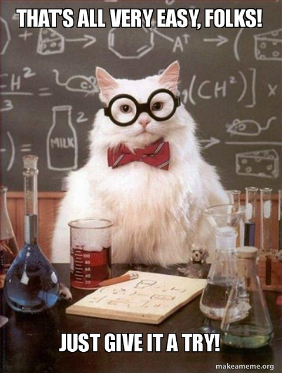
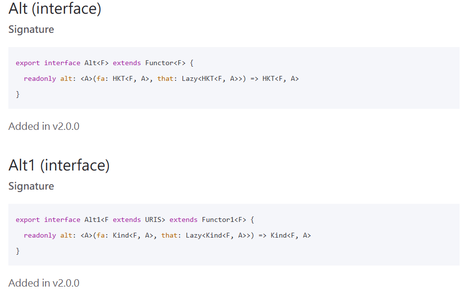
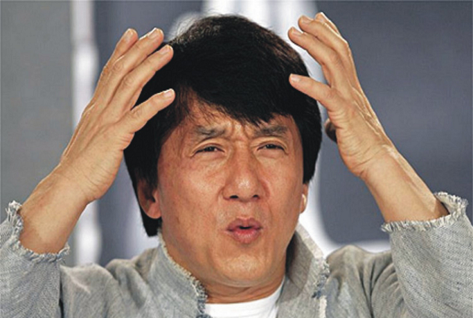

## FP-TS Practice

By Lu-Chin

---

---

---

---

---

---

HKT? Kind ? Functor? Lazy?

---

Monad? Monoid?

Homomorphism? Catamorphism? Isomorphism?

---

---

 

I sincerely hope that one day you can feel ...
