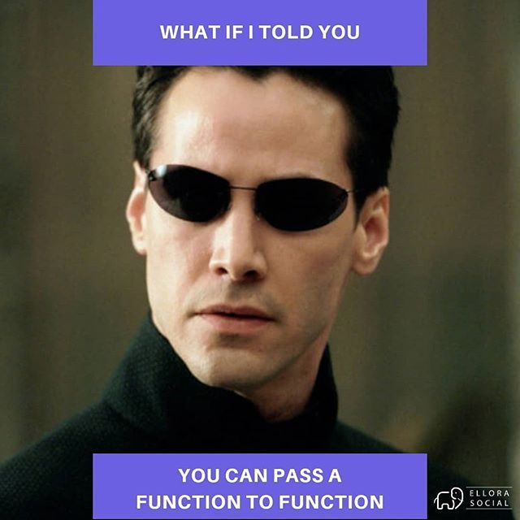
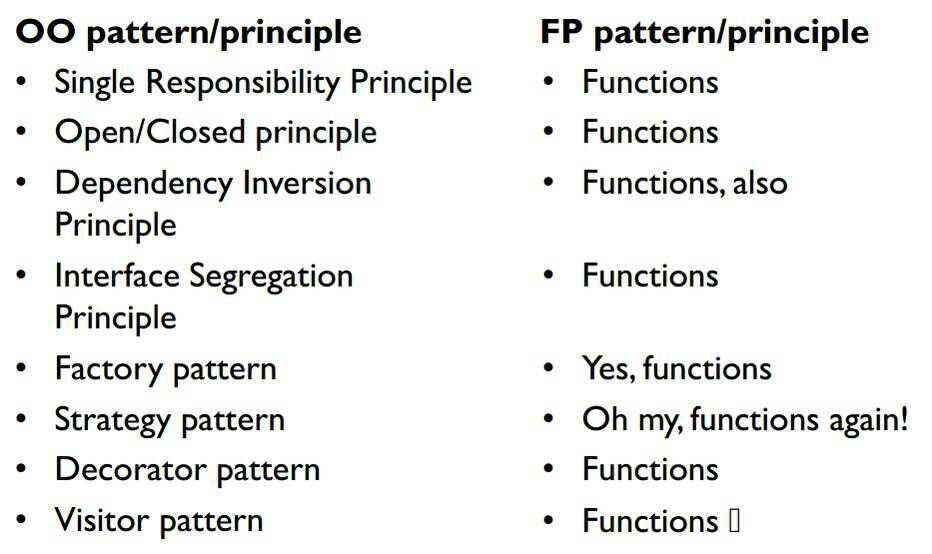
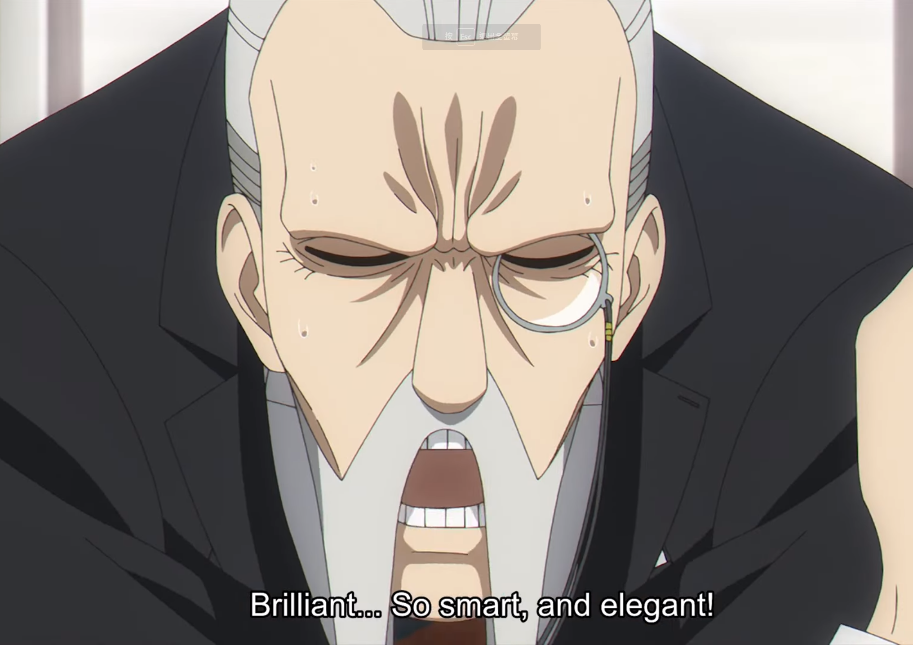
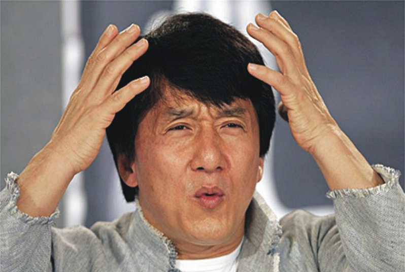

  

# Introduction

  

[↩️](/index.md#/0/1)

---

---

---

---

---

---

HKT? Kind ? Functor? Lazy?

---

Monad? Monoid?

Homomorphism? Catamorphism? Isomorphism?

---

---

 

### Let's start from sample code

 

[↩️](/index.md#/0/1)

<!-- 遇到的問題
如何找解決的方法
解決的方法 -->

<!-- # Todo
  - Option
  - Either
  - Predicate
  - There
- How to load config ?
- Task
- Reader
- Lenses
  - modify
  - reader apply
- Klesili
- Reader
- ReaderTaskEither

- State
- Tree
- There
- Traverse

- OO -->

<!-- - 怎麼使用 These ?
- OptionT
- NonEmptyArray -->
